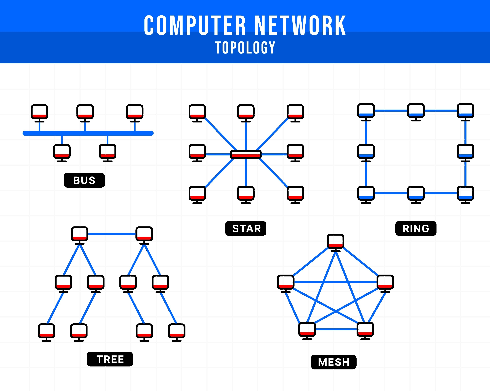

<table width="100%">
  <tr>
    <td align="left" width="120">
      
    </td>
    <td >
      <h1>Broadcast Studio</span></h1>
      <h3 style="margin-top: -10px;">Free open source network simulation, packet tracer alternative</h3>
    </td>
  </tr>
</table>

# Broadcast Studio 📡

## 📖 Overview

**Broadcast Studio** is a web app for studying computer networks, network simulation, and hands-on learning with integrated artificial intelligence. Ideal for students, teachers, and professionals who want to explore, test, and understand network behavior in controlled environments, with support for automated analysis, realistic simulations, and AI-based interactive learning. 🌐

Whether you’re a student, teacher, or IT professional, Broadcast Studio provides the flexibility and power you need to visualize, experiment with, and master the world of computer networks. 💻✨

---

## ✨ Key Features

* **Visual Topology Editor**: Build and visualize topologies by dragging and dropping devices (routers, switches, PCs) onto a canvas. 🖱️
* **Real-Time Simulation**: Watch data traffic and network behavior live. 🚦
* **Integrated Terminal**: Run commands like `ping` and `traceroute` inside a built-in terminal. 🚀
* **Cross-Platform Compatibility**: Web-based and accessible from any device, with future support for a desktop version. 📱🖥️

---

* **Front-end**: Built with **Next.js (React)**, interactive topology editing with **React Flow**.
* **Back-end**: Python API with **CORE Emulator** for creating and managing virtual networks.
* **Connector (Middleware)**: Ensures smooth communication between the UI and the simulation engine.

---

## 🛠️ Technologies Used

### Front-end

* Next.js
* React
* React Flow
* TypeScript
* Tailwind CSS

### Back-end

* Python
* CORE Emulator API

### Development Tools

* Bun (Package Manager)
* ESLint (Code Linter)
* VS Code (Editor)

---

## 🚀 Getting Started

### 📌 Prerequisites

* **Bun** must be installed on your system.

### ⚙️ Setup

```bash
# Clone the repository
git clone https://github.com/lukaulk/broadcast-studio.git

# Navigate into the project directory
cd broadcast-studio
```

### 📦 Installation

```bash
# Install front-end dependencies with Bun
bun install
```

### ▶️ Running the Project

```bash
# Start the development server
bun dev
```

Open your browser and go to **[http://localhost:3000](http://localhost:3000)** to see Broadcast Studio in action. 🎉

---

## 🤝 Contributing

Contributions are always welcome! 🙌

* Open an *issue* to report bugs or suggest improvements.
* Submit a *pull request* for new features or fixes.

---

## 📜 License

This project is licensed under the **MIT License**.

---


